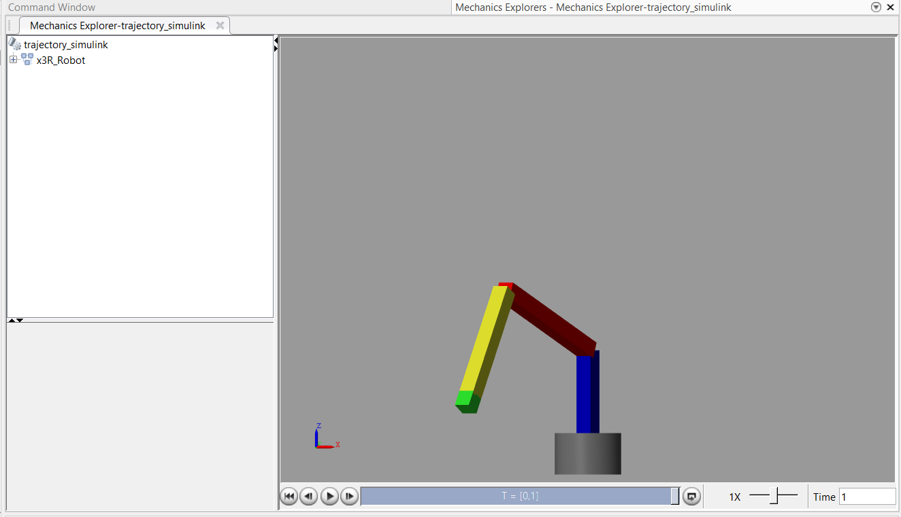
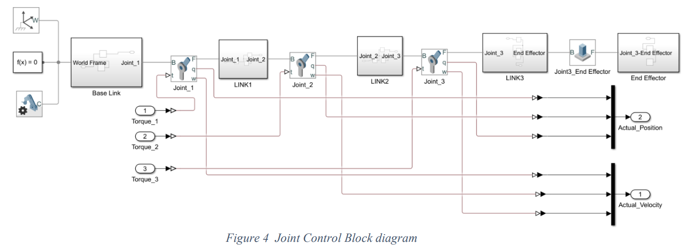
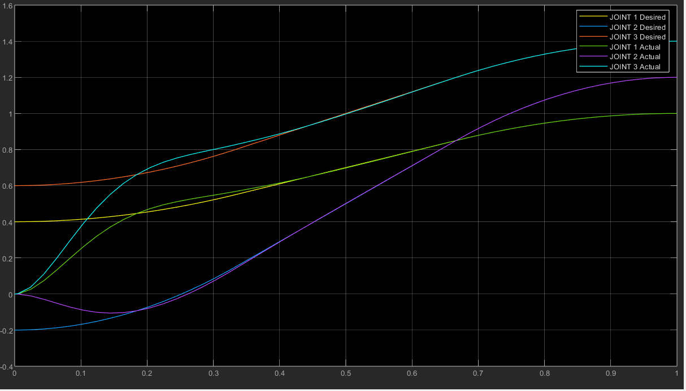

# Computed Torque Control (CTC) for 3R Articulated Robot

## Overview
This repository contains Simulink files implementing Computed Torque Control (CTC) for a 3R articulated robot. The Simulink model includes:
- Mechanical model of the 3R robot
  
- Control blocks for implementing CTC
  
- Trajectory planning simulations
  

## Contents
- **`3R_robot_model.slx`**: Simulink model file containing the complete setup for the 3R robot.
- **`trajectory_simulink.slx`**: Simulink model for testing trajectory planning algorithms.

## Usage
1. **Simulink Setup**: Open `3R_robot_model.slx` in MATLAB/Simulink.
2. **Run Simulations**: Modify parameters as needed and simulate to observe the CTC behavior.
4. **Trajectory Planning**: Use `trajectory_simulink.slx` to test trajectory generation algorithms.

## Dependencies
- MATLAB
- Simulink

## Authors
Sivanesan A, Department of Robotics and Automation, PSG College of Technology, Coimbatore, Tamil Nadu.
Priyadharshan R, Department of Robotics and Automation, PSG College of Technology, Coimbatore, Tamil Nadu.
Dr. M.P Anbarasi, Department of Robotics and Automation, Faculty of Engineering Technology, PSG College of Technology, Coimbatore, Tamil Nadu.

